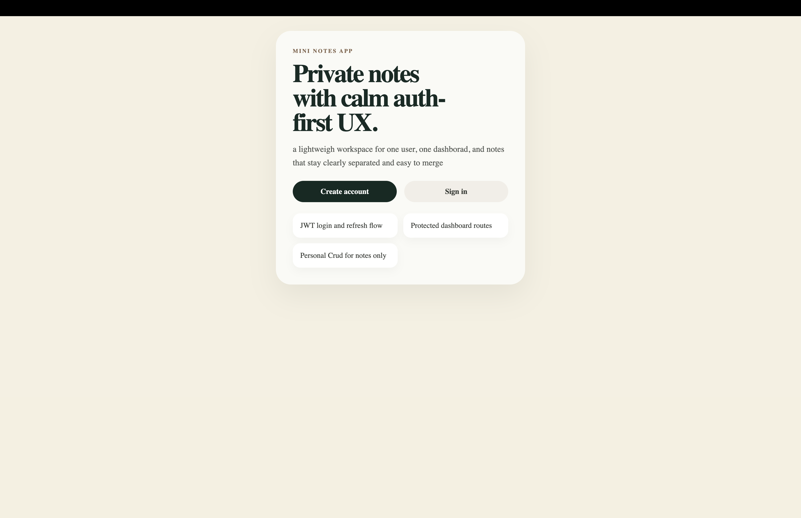
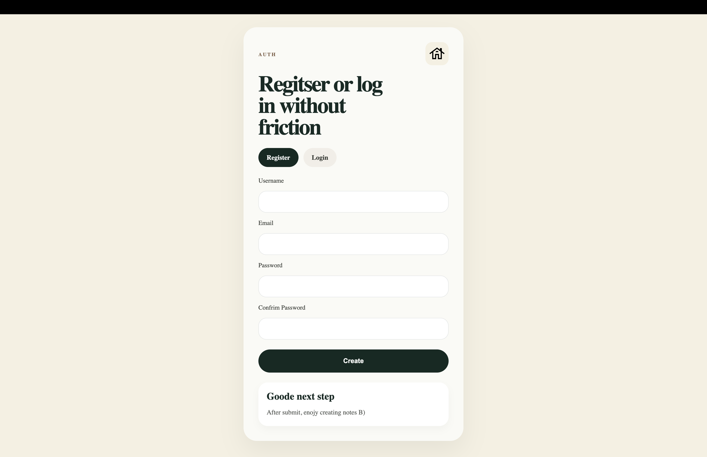
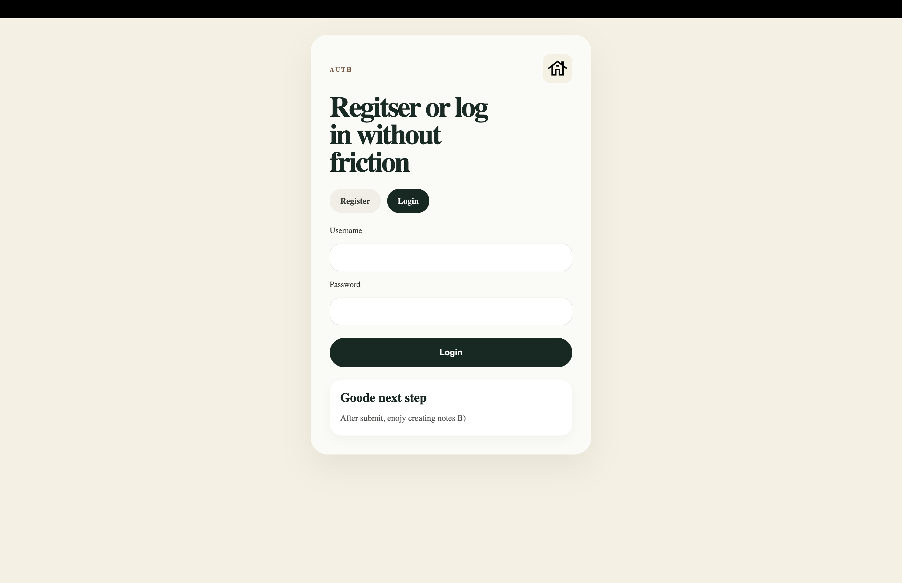
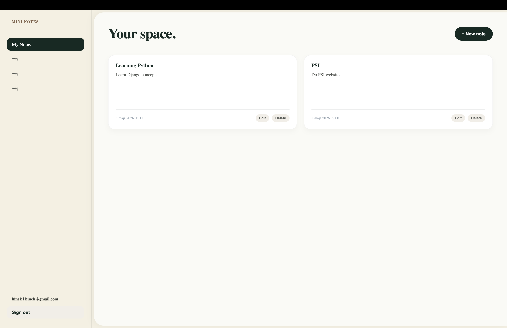
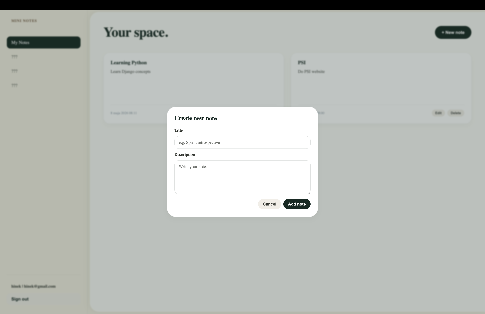
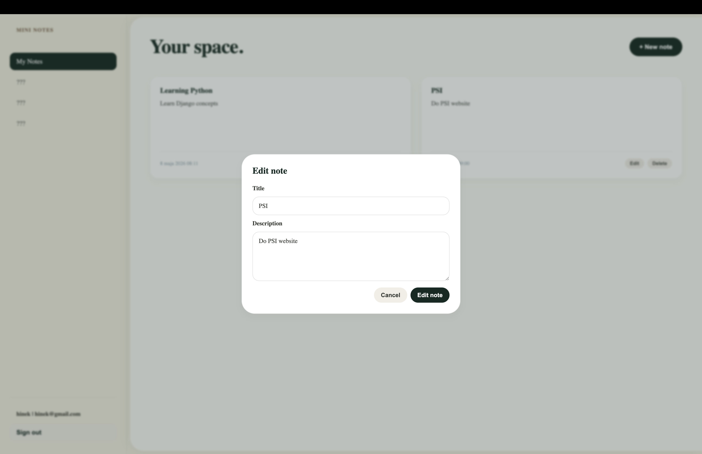

# Mini Notes App


A small full-stack notes app built to practice:

- JWT auth (register/login/refresh)
- protected API + user-scoped CRUD
- a calm React UI
- deployment-ready containers (Django + Gunicorn, Nginx, Postgres)

Core rule: every user only sees and edits their own notes.

## Tech Stack

**Frontend**
- React 19
- Vite
- React Router
- Axios
- React Hot Toast

**Backend**
- Django
- Django REST Framework
- Simple JWT

**Database**
- PostgreSQL (Docker / Railway)
- SQLite (optional legacy/dev mode to export old local data)

**Tooling**
- Docker / Docker Compose
- ESLint

## Features

- User registration
- JWT login + refresh
- Current user endpoint (`me`)
- Notes CRUD (list/create/edit/delete)
- Ownership checks (users can only access their own notes)
- Basic backend API tests

## API Endpoints

**Auth**
- `POST /api/auth/register/`
- `POST /api/auth/login/`
- `POST /api/auth/refresh/`
- `GET /api/auth/me/`

**Notes**
- `GET /api/notes/`
- `POST /api/notes/`
- `GET /api/notes/<id>/`
- `PUT /api/notes/<id>/`
- `DELETE /api/notes/<id>/`

## Screenshots

Landing page  


Register form  


Login form  


Dashboard  


Add note flow  


Edit note flow  


## Project Structure

```text
mini-notes-app/
├─ backend/                # Django + DRF API
├─ frontend/               # React + Vite app (served by nginx)
├─ scripts/                # local helper scripts
├─ docker-compose.yml
├─ .env.example
└─ README.md
```

## Quick Start (Local, Docker)

Prerequisites:
- Docker Desktop

1) Create env file (repo root):

```bash
cp .env.example .env
```

2) Start everything:

```bash
docker compose up --build
```

3) Open:
- Frontend: http://localhost/
- API: http://localhost/api/

Notes:
- Frontend proxies `/api/*` → backend (private Docker network).
- Backend runs migrations + `collectstatic` automatically on container start.

## Local Setup (No Docker)

Docker is recommended for parity with deploy, but you can run services separately.

### Backend (API)

```bash
cd backend
python3 -m venv .venv
source .venv/bin/activate
pip install -r requirements.txt
python manage.py migrate
python manage.py runserver
```

### Frontend (UI)

```bash
cd frontend
npm install
npm run dev
```

When running without Docker, set:
- `frontend/.env` → `VITE_API_URL=http://localhost:8000/api/`

## Testing

Run backend tests:

```bash
cd backend
python manage.py test
```

## Deploy on Railway

Recommended layout (1 project, 3 services):
- `postgres` (Railway managed DB)
- `backend` (private service, Django/Gunicorn)
- `frontend` (public service, Nginx static + `/api` proxy)

### 1) Create services

1. Create a Railway project
2. Add a Postgres database (Railway “Database → Postgres”)
3. Add two services from this repo:
   - **backend**: Dockerfile path `backend/Dockerfile`
   - **frontend**: Dockerfile path `frontend/Dockerfile`

### 2) Backend variables (Railway)

In `backend` → Variables:
- `DEBUG=False`
- `SECRET_KEY=...` (strong secret)
- `PORT=8000`
- `DATABASE_URL` as a **reference variable** to your Postgres `DATABASE_URL`
- `CORS_ALLOWED_ORIGINS=https://<your-frontend-domain>`
- (optional) `CSRF_TRUSTED_ORIGINS=https://<your-frontend-domain>`

Notes:
- The app also reads `RAILWAY_PUBLIC_DOMAIN` automatically to extend `ALLOWED_HOSTS` / `CSRF_TRUSTED_ORIGINS`.

### 3) Frontend variables (Railway)

In `frontend` → Variables:
- `API_UPSTREAM=backend.railway.internal:8000`

Then enable Public Networking on the frontend service and generate a domain.

### 4) Migrations

Backend runs the following automatically on start:
- `python manage.py migrate`
- `python manage.py collectstatic`

## Data Migration (SQLite → Postgres)

If you previously used `backend/db.sqlite3` and now run Postgres, your old notes won’t appear automatically.

This repo includes a helper script that:
- dumps data from SQLite (`USE_SQLITE=True`)
- loads it into Postgres

Run (PowerShell, Windows):

```powershell
powershell -ExecutionPolicy Bypass -File .\scripts\migrate-sqlite-to-postgres.ps1
```

## Troubleshooting

### 405 Method Not Allowed

- `GET /api/auth/login/` returns `405` by design (login expects `POST`).
- If you see `POST /auth/login/ 405`, your frontend is not calling `/api/...` (wrong base URL or stale cached bundle).

### Common Railway issues

- **App not reachable**: service must listen on `0.0.0.0:$PORT`.
- **DisallowedHost**: add your domain to `ALLOWED_HOSTS` (handled automatically when `RAILWAY_PUBLIC_DOMAIN` is present).
- **CORS blocked**: set `CORS_ALLOWED_ORIGINS` to your frontend domain (https).
- **DB connection errors**: use Railway Postgres `DATABASE_URL` (reference variable) instead of Docker hostnames like `db`.

