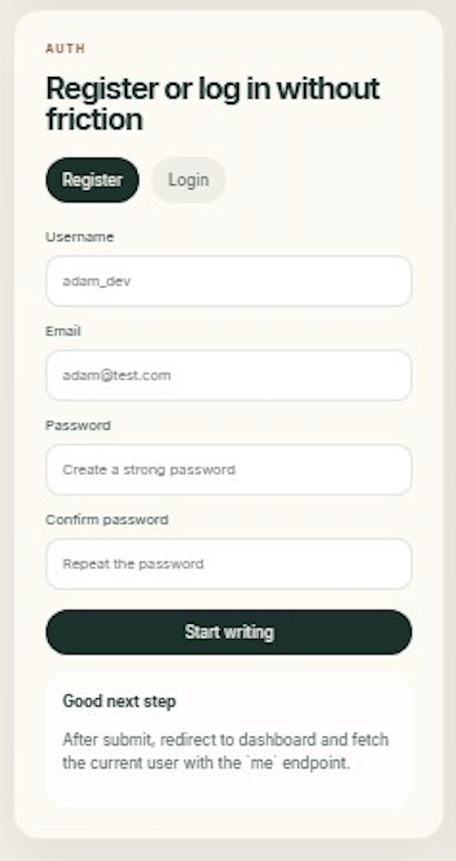

# Mini Notes App

Full-stack notes application built to practice authentication, protected API access, and user-scoped CRUD flows.

This project focuses on a simple idea:

- users create an account
- users log in with JWT
- users manage personal notes
- users can only see and modify their own data

It was built as a portfolio-style learning project with a strong focus on clean backend fundamentals and a calm, intentional frontend UI.

## Tech Stack

Frontend:
- React 19
- Vite
- React Router
- Axios
- React Hot Toast

Backend:
- Django
- Django REST Framework
- Simple JWT

Database:
- SQLite

Tooling:
- Docker
- Docker Compose
- ESLint

## Features

Implemented:
- user registration
- JWT login
- token refresh endpoint
- current user endpoint (`me`)
- protected dashboard route
- note list
- create note
- edit note
- delete note
- user-specific note access control
- automated backend API tests

Current frontend status:
- authentication pages are implemented
- dashboard is connected to the backend
- notes can be fetched, created, edited, and deleted from the UI

## Why This Project Matters

This repository is less about business complexity and more about solid application structure:

- custom user model in Django
- DRF serializers built per use case
- JWT-based auth flow
- ownership checks on note resources
- protected frontend routes
- basic automated API test coverage

It is meant to demonstrate practical full-stack thinking, not just isolated UI work.

## API Overview

Auth:
- `POST /api/auth/register/`
- `POST /api/auth/login/`
- `POST /api/auth/refresh/`
- `GET /api/auth/me/`

Notes:
- `GET /api/notes/`
- `POST /api/notes/`
- `GET /api/notes/<id>/`
- `PUT /api/notes/<id>/`
- `DELETE /api/notes/<id>/`

## Screenshots

Home


Auth



## Project Structure

```text
mini-notes-app/
├─ backend/        # Django + DRF API
├─ frontend/       # React + Vite app
├─ docker-compose.yml
├─ README.md
├─ PROJECT_OVERVIEW.md
└─ ROADMAP.md
```

## Local Setup

### Backend

```bash
cd backend
python3 -m venv .venv
source .venv/bin/activate
pip install -r requirements.txt
python manage.py migrate
python manage.py runserver
```

### Frontend

```bash
cd frontend
npm install
npm run dev
```

### Docker

```bash
docker compose up --build
```

## Testing

Backend API tests are written for:
- auth registration
- auth login
- auth refresh
- current user endpoint
- note permissions
- note CRUD flows

Run:

```bash
cd backend
python manage.py test
```

## Current Status

The application is already functional as an MVP and suitable as a portfolio project, but still in active refinement.

Planned polish:
- smoother auth UX
- improved error handling
- stronger token refresh flow on the frontend
- deployment-focused configuration

## Documentation

Additional project notes:
- [Project Overview](./PROJECT_OVERVIEW.md)
- [Roadmap](./ROADMAP.md)
